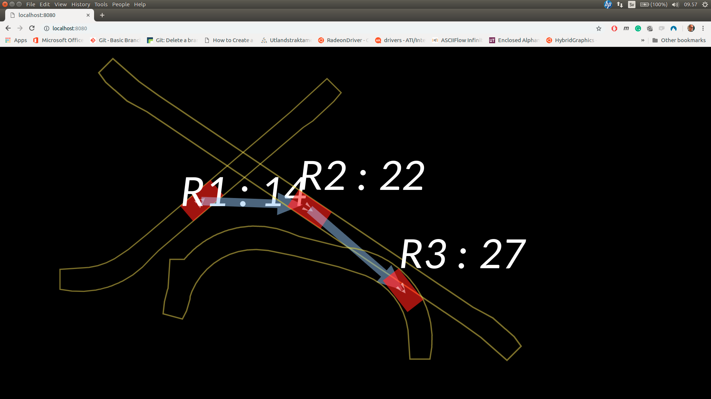
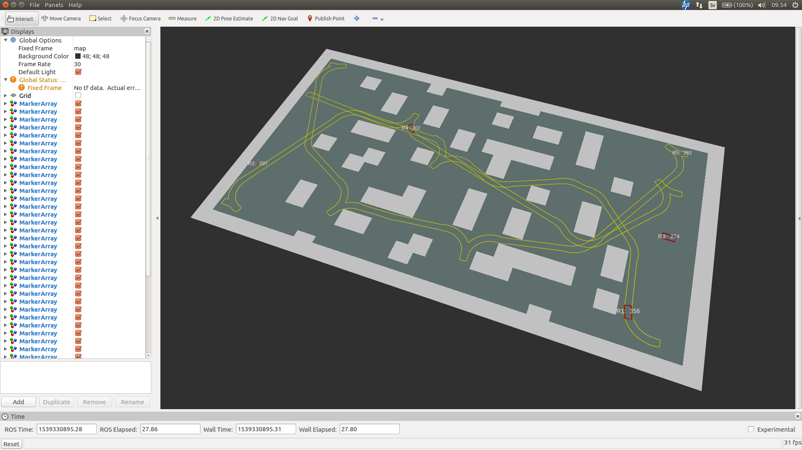

# A Framework for Multi-Robot Motion Planning, Coordination and Control 

This software implements an _online coordination method for multiple robots_. Its main features are:

* Goals can be posted and paths computed online
* Precedences are inferred online, accounting for robot dynamics via provided dynamic models
* Very few assumptions are made on robot controllers
* The coordination method is not specific to a particular motion planning technique

The software includes a basic 2D robot simulation and a simple built-in motion planner (which depends on the <a href="http://ompl.kavrakilab.org/">OMPL</a> and <a href="http://www.mrpt.org/">MRPT</a> libraries). A <a href="https://github.com/FedericoPecora/coordination_oru_ros">separate interface package</a> is provided to enable the use of this software in conjunction with <a href="http://www.ros.org/">ROS</a> and the <a href="https://github.com/OrebroUniversity/navigation_oru-release">navigation_oru</a> stack to obtain a fully implemented stack for multi-robot coordination and motion planning.

## Overview
The algorithm provided by this implementation is detailed in

* Federico Pecora, Henrik Andreasson, Masoumeh Mansouri, and Vilian Petkov, <a href="https://www.aaai.org/ocs/index.php/ICAPS/ICAPS18/paper/view/17746/16941">A loosely-coupled approach for multi-robot coordination, motion planning and control</a>. In Proc. of the International Conference on Automated Planning and Scheduling (ICAPS), 2018.

[](http://www.youtube.com/watch?v=jCgrCVWf8sE "Examples usages of the coordination_oru library")

The approach makes very few assumptions on robot controllers, and can be used with any motion planning method for computing kinematically-feasible paths. Coordination is seen as a high-level control scheme for the entire fleet. Heuristics are used to update precedences of robots through critical sections while the fleet is in motion, and the dynamic feasibility of precedences is guaranteed via the inclusion of user-definable models of robot dynamics. 

The coordination method is based on the _trajectory envelope_ representation provided by the <a href="http://metacsp.org">Meta-CSP framework</a>. This representation is detailed in

* Federico Pecora, Marcello Cirillo, Dimitar Dimitrov, <a href="http://ieeexplore.ieee.org/abstract/document/6385862/">On Mission-Dependent Coordination of Multiple Vehicles under Spatial and Temporal Constraints</a>, IEEE/RSJ International Conference on Intelligent Robots and Systems (2012), pp. 5262-5269.

In short, a trajectory envelope is a set of spatio-temporal constraints on a robot's trajectory. A trajectory envelope spans over a _path_, which is a sequence of _poses_ ```<p1, ... pn>```. In the current implementation, the spatial constraints defining a trajectory envelope are computed as the sweep of the robot's footprint over the path.

## Tutorial
The approach is discussed in detail in the tutorial on _Integrated Motion Planning, Coordination and Control for Fleets of Mobile Robots_, given at the <a href="http://icaps18.icaps-conference.org/tutorials/">2018 International Conference on Automated Planning and Scheduling (ICAPS)</a> by F. Pecora and M. Mansouri. Slides and source code of the tutorial are available <a href="https://gitsvn-nt.oru.se/fopa/coordination-tutorial-src-ICAPS-2018">here</a>.

## Installation
To install, clone this repository and compile the source code with gradle (redistributable included):

```
$ git clone https://github.com/FedericoPecora/coordination_oru.git
$ cd coordination_oru
$ ./gradlew install
```

## Running an example
A number of examples are provided. Issue the following command from the source code root directory for instructions on how to run the examples:
```
$ ./gradlew run
```
In the example ```TestTrajectoryEnvelopeCoordinatorThreeRobots```, missions are continuously posted for three robots to reach locations along intersecting paths. The paths are stored in files provided in the ```paths``` directory. The poses of locations and pointers to relevant path files between locations are stored in the self-explanatory ```paths/test_poses_and_path_data.txt``` file.

## Visualizations
The API provides three visualization methods:

* ```BrowserVisualization```: a browser-based visualization.
* ```JTSDrawingPanelVisualization```: a Swing-based visualization.
* ```RVizVisualization```: a visualization based on the ROS visualization tool <a href="http://wiki.ros.org/rviz">RViz</a>.

All three visualizations implement the abstract ```FleetVisualization``` class, which can be used as a basis to create your own visualization.

Most examples use the ```BrowserVisualization```. The state of the fleet can be viewed from a browser at <a href="http://localhost:8080">http://localhost:8080</a>. The image below shows this visualization for the ```TestTrajectoryEnvelopeCoordinatorThreeRobots``` example:



An arrow between two robots indicates that the source robot will yield to the target robot. Priorities are computed based on a heuristic (which can be provided by the user) and a forward model of robot dynamics (which can also be provided, and is assumed to be conservative - see the <a href="http://iliad-project.eu/wp-content/uploads/papers/PecoraEtAlICAPS2018.pdf">ICAPS 2018 paper</a> mentioned above). The specific poses at which robots yield are also updated online, based on the current positions of robots and the intersecting areas of their trajectory envelopes (critical sections). This makes it possible to achieve "following" behavior, that is, the yielding pose of a robot is updated online while the "leading" robot drives.

The a Swing-based GUI provided by class ```JTSDrawingPanelVisualization``` looks like this:


This GUI allows to take screenshots in SVG, EPS and PDF formats by pressing the ```s```, ```e``` and ```p``` keys, respectively (while focus is on the GUI window). Screenshots are saved in files named with a timestamp, e.g., ```2017-08-13-11:13:17:528.svg```. Note that saving PDF and EPS files is computationally demanding and will temporarily interrupt the rendering of robot movements; SVG screenshots are saved much quicker.

The ```RVizVisualization``` visualization publishes <a href="http://wiki.ros.org/rviz/DisplayTypes/Marker">visualization markers</a> that can be visualized in <a href="http://wiki.ros.org/rviz">RViz</a>. The class also provides the static method ```writeRVizConfigFile(int ... robotIDs)``` for writing an appropriate RViz confiuration file for a given set of robots. An example of the visualization is shown below.



The visualization with least computational overhead is the ```RVizVisualization```, and is recommended for fleets of many robots. The ```BrowserVisualization``` class serves an HTML page with a Javascript which communicates with the coordinator via websockets. Although rendering in this solution is less efficient than in RViz, the rendering occurs on the client platform (where the browser is running), so its computational overhead does not necessarily affect the coordination algorithm. The ```JTSDrawingPanelVisualization``` is rather slow and not recommended for fleets of more than a handful of robots, however it is practical (not requiring to start another process/program for visualization) and relatively well-tested.

## Logging

More detailed information about execution is posted in the terminal and saved to log files. Log files can be inspected offline by running class ```coordination_oru.util.BrowseLogs```, which opens a log browsing GUI. Each panel in the GUI shows the output of one of the class instances that ran in the previous execution of the test program. Several of these classes are instantiated in separate threads, and messages produced concurrently are highlighted when the caret position in one of the panels is updated by the user. The key-bindings Alt-\<X\> and Ctrl-Alt-\<X\> can be used to quickly select panel \<X\> in the top and bottom pane, respectively.  


## The ```SimpleReedsSheppCarPlanner``` motion planner

A simple motion planner is provided for testing the coordination framework without the need for pre-computed path files. The planner can be used to obtain paths for robots with Reeds-Shepp kinematics (Dubin's car-like robots that can move both forwards and backwards), and is used in several of the included demos.

The provided motion planner depends on the <a href="http://ompl.kavrakilab.org/">Open Motion Planning Library (OMPL)</a>, and the <a href="http://www.mrpt.org/">Mobile Robot Programming Toolkit (MRPT)</a>. The motion planner and its Java interface are purposefully kept very simple. It performs rather poorly in terms of the quality of paths it returns, and is _not_ suited for anything beyond simple examples. Please consider developing a more performing and principled integration with your motion planning software of choice, as done in the <a href="https://github.com/FedericoPecora/coordination_oru_ros">coordination_oru_ros</a> package.

## Installing the ```SimpleReedsSheppCarPlanner``` motion planner

Please install the OMPL and MRPT libraries. Both are present in the official Ubuntu repositories (tested on Ubuntu 16.04):

```
$ sudo apt-get install libompl-dev
$ sudo apt-get install mrpt-apps libmrpt-dev
```

Then, compile and install the ```simplereedssheppcarplanner``` shared library as follows:

```
$ cd coordination_oru/SimpleReedsSheppCarPlanner
$ cmake .
$ make
$ sudo make install
$ sudo ldconfig
```

This will install ```libsimplereedssheppcarplanner.so``` in your ```/usr/local/lib``` directory. A simple JNA-based Java interface to the library is provided in package ```se.oru.coordination.coordination_oru.motionplanning```. The Java class  ```ReedsSheppCarPlanner``` in the same package can be instantiated and used to obtain motions for robots with Reeds-Shepp kinematics.

## Using the ```SimpleReedsSheppCarPlanner``` motion planner

A simple example showing how to invoke the motion planner is provided by class ```TestReedsSheppCarPlanner``` in package ```se.oru.coordination.coordination_oru.motionplanning.tests```.

Most of the coordination examples make use of the motion planner (see screenshot below). Issue command

```$ ./gradlew run```

for a list of all provided examples and instructions on how to run them (and/or see package ```se.oru.coordination.coordination_oru.tests```).


## Experience Based Planning
The Experience based planning update to the coordination framework allows for storing the previous planning experiences into a database and reuse them during future planning.

### Updates:
* Currently the Lightning and Thunder frameworks provided by OMPL have been implemented for the ReedsSheppCarPlanner.
* Two new test cases have been added to simulate a narrow corridor and H-BRS university layout.
* The RViz visualization has been fixed to show the map published on the /map topic
* A graph visualization tool has been developed to display the experiences stored in the databases

### Dependencies:
* **OMPL 1.4.2** - Installation instructions can be found <a href="http://ompl.kavrakilab.org/installation.html">here</a>. Generation of python bindings takes a lot of time (several hours). Since we do not need python bindings, install OMPL without bindings for faster build.

### Usage:
* Clone this repository
```
git clone git@github.com:Sushant-Chavan/coordination_oru.git
```
* cd to the coordination_oru directory
```
cd coordination_oru/
```
* Checkout the branch ExperinceBasedPlanning
```
git checkout ExperinceBasedPlanning
```
* Run any desired test. For example to run the University test case use the command:
```
./gradlew run -Pdemo=customTests.University
```
or to specify number of simulation iterations (for example 2 itertions) as well, use:
```
./gradlew run -Pdemo=customTests.University -Pitr=2
```
* Visualization medium depends the test case. Tests based on JAVA Swing will automatically launch the visualization. For browser based visualization, open the link <a href="http://localhost:8080">http://localhost:8080</a>. For RViz visualization (which is used for all newly added tests) start RViz with the custom generated RViz config file after launching the test case using the below command:
```
rosrun rviz rviz -d ~/config.rviz
```
* A list of all available tests can be found using the command:
```
./gradlew run
```
* Build the graph visualization tool using the following commands:
```
cd graphml_generator/
mkdir build
cd build/
rm -rf * && cmake .. && make
cd ../../
```
* Plot the database using the command:
```
python3 graphml_generator/PlotDatabase.py --map_image_filename=test-uni.png
```

### Switching between different frameworks:
* The switch between Simple, Lightning and Thunder frameworks can be done by choosing the desired plannerType in the function ```doPlanning()``` in [ReedsSheppCarPlanner.java](src/main/java/se/oru/coordination/coordination_oru/motionplanning/ompl/ReedsSheppCarPlanner.java)
* To plot the Thunder databases, the plotting script needs additional paramaters. For example for the university test case, the script should be called as follows after the thunder database has been generated:
```
python3 graphml_generator/PlotDatabase.py --map_image_filename=test-uni.png --is_thunder_db
```

### Choosing a different planning algorithm in ReedsSheepCarPlanner
It is possible to use different planning algorithms instead of the default RRT-Connect alogorithm used by the ReedsSheepCarPlanner. For example to switch to the RRT-Star planning algorithm, change the lines containing ```ob::PlannerPtr planner(new og::RRTConnect(si));``` to ```ob::PlannerPtr planner(new og::RRTstar(si));``` in the file [MultipleCircleReedsSheppCarPlanner.cpp](SimpleReedsSheppCarPlanner/src/MultipleCircleReedsSheppCarPlanner.cpp)

Then recompile and install the updated ReedsShepp planning library using the below commands:
```
cd SimpleReedsSheppCarPlanner/
mkdir build
cd build/
rm -rf * && cmake .. && make && sudo make install && sudo ldconfig
```

### Training dataset generation
It is possible to automatically generate random navigation problems which can be used to bootstrap the planning frameworks with some initial experinces. The start and goal poses for training can either be generated uniformly throughout the map or at user provided hotspots in the map. Hotspots can be easily added to a config file corresponding to the map and each entry of the file represents the centre(x and y) and the half width and half height of the bounding box. Samples are then generated using a multivariate_uniform distribution such that majority of the samples are generated within these hotspots.

It is also possible to generate arbitrary number of planning problems. The required number of planning problems should be passed when invoking the script. Additionally, it is possible to generate a plot of the generated samples and planning problems to verify that the generated samples are valid and good for training the planning frameworks.

To generate dataset consisting of 100 problems, without using hotspots, for the map named ```BRSU_Floor0.png``` along with debug image for verification use the command:
```
python3 generators/dataset/GenerateTrainingDataset.py BRSU_Floor0.png --nProblems 100  --dbg_image=True --robot_radius=25
```

To generate for different number of problems (for example 10 problems, 100 problems) simultatneously, modify the command as:
```
python3 generators/dataset/GenerateTrainingDataset.py BRSU_Floor0.png --nProblems 10 100  --dbg_image=True --robot_radius=25
```

To use the user provided hotspots, use the command:
```
python3 generators/dataset/GenerateTrainingDataset.py BRSU_Floor0.png --nProblems 100  --dbg_image=True --robot_radius=25 --use_hotspots=True
```

### Training the planning frameworks using the training datasets
The planning frameworks can be trained using the training dataset for any given framework. The experiences gained during training can help bootstrap and accelerate the planning of future plans. When generating the training experiences, the planning from recall of the planning framework is disabled so that we generate clean, unbiased solutions for each training problem.

To generate experiences for a map named ```BRSU_Floor0.png```, for 10 experiences using a robot whose footprint has a bounding box of -0.25 0.25 -0.25 0.25 (coresponding to min_x, max_x, min_y, max_y) for the Thunder framework, use the command:
```
python3 generators/dataset/GenerateExperiences.py BRSU_Floor0.png --training_dataset_count=10 --footprint -0.25 0.25 -0.25 0.25 --planner_type=2
```
Check the help of this script for details about additional params


## Sponsors
This project is supported by

* The <a href="http://semanticrobots.oru.se">Semantic Robots</a> Research Profile, funded by the <a href="http://www.kks.se/">Swedish Knowledge Foundation</a>
* The <a href="https://iliad-project.eu/">ILIAD Project</a>, funded by the <a href="https://ec.europa.eu/programmes/horizon2020/">EC H2020 Program</a>
* The iQMobility Project, funded by <a href="https://www.vinnova.se/">Vinnova</a>

## License
coordination_oru - Online coordination for multiple robots

Copyright &copy; 2017-2018 Federico Pecora

This program is free software: you can redistribute it and/or modify it under the terms of the GNU General Public License as published by the Free Software Foundation, either version 3 of the License, or (at your option) any later version.

This program is distributed in the hope that it will be useful, but WITHOUT ANY WARRANTY; without even the implied warranty of MERCHANTABILITY or FITNESS FOR A PARTICULAR PURPOSE.  See the GNU General Public License for more details.

You should have received a copy of the GNU General Public License along with this program.  If not, see <http://www.gnu.org/licenses/>.
